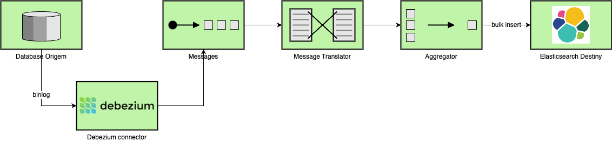
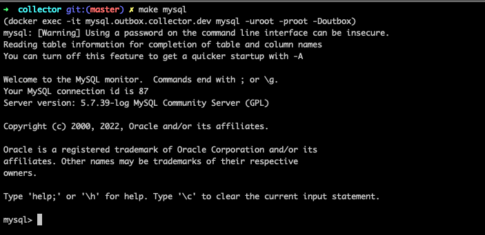

# POC Camel Outbox Collector

Exemplo de solução utilizando Debezium com apache camel para manter sincrizadas informações de base de dados de produção com elasticsearch para buscar.

Esta POC tem como objetivo ser um material de apoio para apresentar uma abordagem simplória em que dependêndo do cenário pode ser de grande valia, como por exemplo aliviar consultas em banco de dados produtivo e possibilitar consultas mais complexas utilizando outras soluções. No exemplo construído esta sendo utilizada uma instância de ElasticSearch.

A implementação conta também com um aggregator para construir os lotes para persistir os dados de forma mais performática e também os quebrando em índices no Elasticsearch de acordo com a data de criação (ex: `events-2022-01`).


<p align="center" width="100%">
    
</p>

## Casos de uso.

- Evitar uso de índices complexos utilizando bancos de dados relacionais e mantendo réplica de leituraa possíbilidade de utilização de uma solução híbrida (ex: MySql usando para consulta ElasticSearch), ou até mesmo estruturar os dados para povoar tabelas utilizando a própria solução de banco de dados (ex: construção de cubos muito comum em eng. de dados).
- Utilizar como estratégia de estrangulamento de aplicações, como por exemplo construir uma nova solução e utilizar um outbox com garantias ACID para manter legado atualizado até que consiga ser desligado definitivamente.
- Contrução de datalakes em `near-real-time` enviando informações coletadas em lotes de arquivos para soluções de storage tal como S3, FTP, ou até mesmo um servidor local.
- Possibilidade de enviar eventos para serviços de mensageria tal como Kafka, SQS, SNS, Azure service bus entre outros para assim alimentar 1..n consumidores com a possibilidade de utilziar multicast.
- Flexibilidade de customizar os eventos coletados atravéz do componente Debezium do Apache Camel e utilizar com frameworks tal como Spring boot e Quarkus.
- Implementação de offset storage e database history utilizando mysql como uma das possíveis alternativas.

## Bibliotecas.

| Library                  | Artifact                             |
|--------------------------|--------------------------------------|
| org.apache.camel         | camel-kafka                          |
| org.apache.camel         | camel-debezium-mysql                 |
| org.apache.camel         | camel-elasticsearch-rest             |
| org.elasticsearch.client | elasticsearch-rest-high-level-client |

## Infra UP

Comando para subir serviços e efetuar setup inicial da solução.

```shell
make infra-up
```

## Infra DOWN

Comando para parar todos os seviços.

```shell
make infra-down
```

## Acessar MySql

Comando para acessar instência MySql para gerar inserir dados e por sua vez gerar eventos para serem persistidos no elasticsearch.

```shell
make mysql
```

<p align="center" width="100%">
     
</p>

Exemplo de instrução de insert

```sql
insert into outbox (id, message, created_at) values (UUID(), '{"name":"example","uuid":"ee8699ef-bbbc-4e20-91ff-4579690dae55","created_at":"2022-08-09T20:30:48.908+00:00","properties":{}}', now());
```

| Coluna                   | Descrição                         | Exemplo                               |
|--------------------------|-----------------------------------|---------------------------------------|
| id                       | Identificador formato UUID        | ee8699ef-bbbc-4e20-91ff-4579690dae55  |
| message                  | Mensagem json que será indexada   | `{"name":"example","properties":{}}`  |
| created_at               | Data de criação do registro       | 2022-08-09T20:30:48.908+00:00         |


Consultar dados no ElasticSearch

```shell
curl -XGET 'http://localhost:9200/events-*/_search' | json_pp -json_opt pretty,canonical
```
> Requisição de listagem de documentos.

```json
{
  "took" : 1170,
  "timed_out" : false,
  "_shards" : {
    "total" : 1,
    "successful" : 1,
    "skipped" : 0,
    "failed" : 0
  },
  "hits" : {
    "total" : {
      "value" : 23,
      "relation" : "eq"
    },
    "max_score" : 1.0,
    "hits" : [
      {
        "_index" : "events-2022-09",
        "_type" : "_doc",
        "_id" : "bc5b2af7-3ae5-11ed-9123-02420a000005",
        "_score" : 1.0,
        "_source" : {
          "name" : "example",
          "uuid" : "ee8699ef-bbbc-4e20-91ff-4579690dae55",
          "created_at" : "2022-09-23T02:16:30+0000",
          "properties" : { },
          "id" : "bc5b2af7-3ae5-11ed-9123-02420a000005"
        }
      },
      {
        "_index" : "events-2022-09",
        "_type" : "_doc",
        "_id" : "bcb900eb-3ae5-11ed-9123-02420a000005",
        "_score" : 1.0,
        "_source" : {
          "name" : "example",
          "uuid" : "ee8699ef-bbbc-4e20-91ff-4579690dae55",
          "created_at" : "2022-09-23T02:16:30+0000",
          "properties" : { },
          "id" : "bcb900eb-3ae5-11ed-9123-02420a000005"
        }
      }
    ]
  }
}
```
> Resposta da requisição ao Elasticsearch.


```shell
docker run -it --net bubble adrianolaselva/collector:latest --spring.application.connector=collector-outbox-mysql
```

## Referências

- [Apache Camel](https://camel.apache.org/)
- [Camel Debezium Mysql Component](https://camel.apache.org/components/3.18.x/debezium-mysql-component.html)
- [Camel Elasticsearch Component](https://camel.apache.org/components/3.18.x/elasticsearch-rest-component.html)
